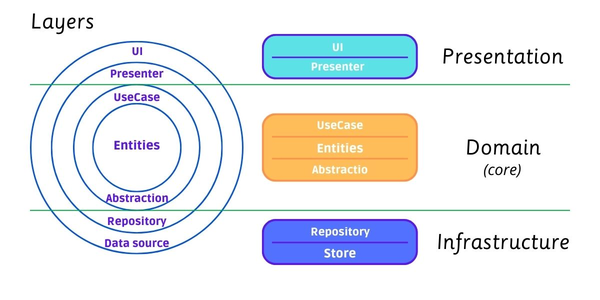
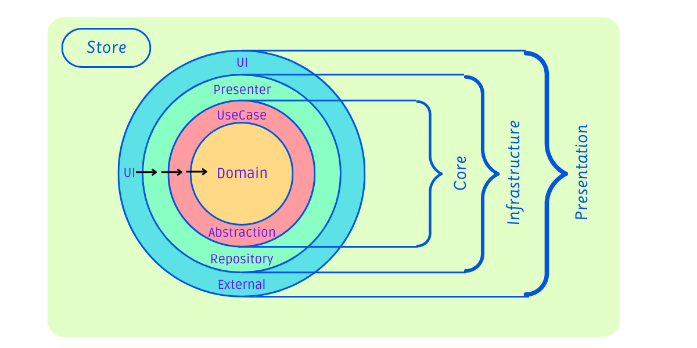

# Angular Clean Architecture

Clean architecture for Angular with state management pattern and best practices

## Layers

## This code is based on

- Clean architecture on Android \
https://speakerdeck.com/markomilos/clean-architecture-on-android?slide=9
- Clean architecture in Frontend \
https://indiedev.medium.com/clean-architecture-in-frontend-react-redux-typescript-bd108ddd13f7

This project was generated with [Angular CLI](https://github.com/angular/angular-cli) version 14.1.2.
